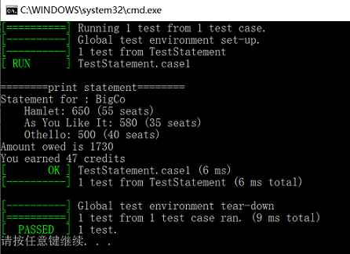

# Refraction
用C++实现 《重构 改善既有代码的设计 第2版》

系统：win10

IDE；VisualStudio 2015

## 第一章 重构，第一个实例

背景：剧院请剧团演出。客户（剧院）会指定几出剧目，而剧团则根据观众人数以及剧目类型像客户（剧院）收费。剧目类型分两种：喜剧、悲剧。另外，再给客户（剧院）发出账单时，还会根据观众人给出客户（剧院）“观众量积分”（volume credt）优惠，下次再请该剧团表演时可以用到。

剧目：

```
{
	"hamlet": {"name": "Hamlet", "type": "tragedy"},
	"as-like": {"name": "As You Like It", "type": "comedy"},
	"othello": {"name": "Othello", "type": "tragedy"}
}
```

单据：

```
{
	"customer" : "BigCo",
	"performances" : 
	[
		{
			"audience" : 55,
			"playID" : "hamlet"
		},
		{
			"audience" : 35,
			"playID" : "as-like"
		},
		{
			"audience" : 40,
			"playID" : "othello"
		}
	]
}
```

### 初始代码

前提：[用C++读取Json](https://www.jianshu.com/p/e0c1f3fdf6f9)([jsoncpp源码](https://github.com/open-source-parsers/jsoncpp))

下面这个简单的函数用以打印账单详情（钱币单位做了简化）

```cpp
void statement(const Json::Value& invoice, const Json::Value& plays)
{
    cout << "\n========" << "print statement" << "========" << endl;
    int totalAmount = 0;
    int volumeCredits = 0;
    cout << "Statement for : " << invoice["customer"].asString() << endl;

    for (const Json::Value& perf : invoice["performances"]) {
        const Json::Value& play = plays[perf["playID"].asString()];
        int thisAmount = 0;
        if (!strcmp(play["type"].asString().c_str(), "tragedy"))
        {
            thisAmount = 400;
            if (perf["audience"].asInt() > 30) {
                thisAmount += 10 * (perf["audience"].asInt() - 30);
            }
        }
        else if (!strcmp(play["type"].asString().c_str(), "comedy"))
        {
            thisAmount = 300;
            if (perf["audience"].asInt() > 20) {
                thisAmount += 100 + 5 * (perf["audience"].asInt() - 20);
            }
            thisAmount += 3 * perf["audience"].asInt();
        }
        else
        {
            cout << "ERROR" << endl;;
        }

        // add volume credits
        volumeCredits += max((perf["audience"].asInt() -  30), 0);
        // add extra credit for every ten comedy attendees
        if ("comedy" ==  play["type"].asString()) volumeCredits += floor(perf["audience"].asInt()/5);
        // print line for this order
        printf("    %s: %d (%d seats)\n", play["name"].asString().c_str(), thisAmount, perf["audience"].asInt());
        totalAmount += thisAmount;
    }
    printf("Amount owed is %d\n", totalAmount );
    printf("You earned %d credits\n", volumeCredits);
}
```

输出：

```
Statement for : BigCo
    Hamlet: 650 (55 seats)
    As You Like It: 580 (35 seats)
    Othello: 500 (40 seats)
Amount owed is 1730
You earned 47 credits
```

### 增加测试用例

重构的第一步就是构建完备的测试用例，这里使用gtest进行测试（文中没有给出）

前提：[gtest环境配置](https://www.jianshu.com/p/8cc54ef3d76b)([gtest源码](https://github.com/google/googletest))

为了能进行测试，这里将账单的计算和打印拆分（**拆分阶段**）。构建一个账单类

```cpp
struct Play {
    Play(string name, int cost, int seats) : name(name), cost(cost), seats(seats) {};
    string name;
    int cost;
    int seats;
};
struct Bill {
    Bill() {};
    Bill(string customer) : customer(customer) , total(0), credit(0){};
    string customer;
    vector<Play> plays;
    int total;
    int credit;
};
```

这样在接口调用的时候就可以分开调用

```cpp
    Bill& bill = statement(invoices, plays);
    printBill(bill);
```

而我们要做的就是检验账单计算的正确性

首先将预设环境设置为Json的读取

```cpp
struct TestStatement : public ::testing::Test
{
protected:
    virtual void SetUp()
    {
        std::string invoicesPath = "frist-sample\\data\\invoices.json";
        jsonReader(invoicesPath, invoices);
        //printInvoices(invoices);

        std::string playsPath = "frist-sample\\data\\plays.json";
        jsonReader(playsPath, plays);
        //printPlays(plays);
    }
    Json::Value invoices;
    Json::Value plays;
};
```

然后对计算出来的账单进行校验

```cpp
TEST_F(TestStatement, case1)
{
    Bill& bill = statement(invoices, plays);
    printBill(bill);
    ASSERT_TRUE(bill.customer == "BigCo");
    ASSERT_TRUE(bill.plays.size() == 3);
    ASSERT_TRUE(bill.plays[0].name == "Hamlet");
    ASSERT_TRUE(bill.plays[0].cost == 650);
    ASSERT_TRUE(bill.plays[0].seats == 55);
    ASSERT_TRUE(bill.plays[1].name == "As You Like It");
    ASSERT_TRUE(bill.plays[1].cost == 580);
    ASSERT_TRUE(bill.plays[1].seats == 35);
    ASSERT_TRUE(bill.plays[2].name == "Othello");
    ASSERT_TRUE(bill.plays[2].cost == 500);
    ASSERT_TRUE(bill.plays[2].seats == 40);
    ASSERT_TRUE(bill.total == 1730);
    ASSERT_TRUE(bill.credit == 47);
}
```

输出：

 

只要保证用例成功，我们就可以随意重构啦。

### 分解statement函数

#### 提炼函数

1. 提炼剧目的计算函数，并且用result作为返回值。可以得到如下：

```cpp
int amountFor(const Json::Value& performance, const Json::Value& play)
{
    int result = 0;
    if (!strcmp(play["type"].asString().c_str(), "tragedy"))
    {
        result = 400;
        if (performance["audience"].asInt() > 30) {
            result += 10 * (performance["audience"].asInt() - 30);
        }
    }
    else if (!strcmp(play["type"].asString().c_str(), "comedy"))
    {
        result = 300;
        if (performance["audience"].asInt() > 20) {
            result += 100 + 5 * (performance["audience"].asInt() - 20);
        }
        result += 3 * performance["audience"].asInt();
    }
    else
    {
        throw "unknow type";
    }
    return result;
}

Bill statement(Json::Value& invoice, Json::Value& plays)
{
    int totalAmount = 0;
    int volumeCredits = 0;
    Bill bill(invoice["customer"].asString());

    for (Json::Value& perf : invoice["performances"]) {
        const Json::Value& play = plays[perf["playID"].asString()];
        int thisAmount = amountFor(perf, play);

        // add volume credits
        volumeCredits += max((perf["audience"].asInt() -  30), 0);
        // add extra credit for every ten comedy attendees
        if ("comedy" ==  play["type"].asString()) volumeCredits += floor(perf["audience"].asInt()/5);
        // print line for this order
        totalAmount += thisAmount;
        Play playPay(play["name"].asString(), thisAmount, perf["audience"].asInt());
        bill.plays.push_back(playPay);
    }
    bill.total = totalAmount;
    bill.credit = volumeCredits;

    return bill;
}
```

另外书中提到了对于函数参数，在为参数取名时会带上默认类型名`amountFor(aPerformance,play)`，这一点在C++中个人感觉太适用，因为C++在函数声明时就必须指定入参类型（模板除外，但模板一般不会用于内置类型）。

下面的部分，由于C++不支持内嵌函数，后面关于**以查询替代临时变量**、**内联变量**、**改变函数声明**(移除`play`参数)，就不再实现了。

[^注]: 当然也可以构建一个类，将`performance`和`play`作为成员，通过函数入参初始化。然后将该类作为一个作用域，进行数据共享，但本例就是一个面向过程的计算账单，没必要故意搞复杂了

#### 内联变量

另外书中还提到了使用**内联变量**将`thisAmount`消除，故而函数改写为

```cpp
// 与书中不一样，这里使用宏实现 以查询替代临时变量
#define PLAY plays[perf["playID"].asString()]

Bill statement(Json::Value& invoice, Json::Value& plays)
{
    int totalAmount = 0;
    int volumeCredits = 0;
    Bill bill(invoice["customer"].asString());

    for (Json::Value& perf : invoice["performances"]) {
        // add volume credits
        volumeCredits += max((perf["audience"].asInt() -  30), 0);
        // add extra credit for every ten comedy attendees
        if ("comedy" ==  PLAY["type"].asString()) volumeCredits += floor(perf["audience"].asInt()/5);
        // print line for this order
        totalAmount += amountFor(perf, PLAY);
        Play playPay(PLAY["name"].asString(), amountFor(perf, PLAY), perf["audience"].asInt());
        bill.plays.push_back(playPay);
    }
    bill.total = totalAmount;
    bill.credit = volumeCredits;
    return bill;
}
```

[^ 注 ]: 因为这里`amountFor`使用了两遍[^书中也使用了两遍]，是一种影响性能的做法

2. 提炼观众积分量函数

```cpp
int volumeCreditsFor(const Json::Value& performance, const Json::Value& play) {
    int result = 0;
    result += max((performance["audience"].asInt() - 30), 0);
    // add extra credit for every ten comedy attendees
    if ("comedy" == play["type"].asString()) result += floor(performance["audience"].asInt() / 5);
    return result;
}

#define PLAY plays[perf["playID"].asString()]
//顶层作用域
Bill statement(Json::Value& invoice, Json::Value& plays)
{
    int totalAmount = 0;
    int volumeCredits = 0;
    Bill bill(invoice["customer"].asString());

    for (Json::Value& perf : invoice["performances"]) {
        volumeCredits += volumeCreditsFor(perf, PLAY);
        totalAmount += amountFor(perf, PLAY);
        Play playPay(PLAY["name"].asString(), amountFor(perf, PLAY), perf["audience"].asInt());
        bill.plays.push_back(playPay);
    }
    bill.total = totalAmount;
    bill.credit = volumeCredits;
    return bill;
}
```

#### 循环拆分

将账单总和、观众量积分总和、打印拆分

```cpp
#define PLAY plays[perf["playID"].asString()]
int totalAmount(Json::Value& invoice, Json::Value& plays)
{
    int result = 0;
    for (Json::Value& perf : invoice["performances"]) {
        result += amountFor(perf, PLAY);
    }
    return result;
}
int totalVolumeCredits(Json::Value& invoice, Json::Value& plays)
{
    int result = 0;
    for (Json::Value& perf : invoice["performances"]) {
        result += volumeCreditsFor(perf, PLAY);
    }
    return result;
}

Bill statement(Json::Value& invoice, Json::Value& plays)
{
    Bill bill(invoice["customer"].asString());
    for (Json::Value& perf : invoice["performances"]) {
        Play play(PLAY["name"].asString(), amountFor(perf, PLAY), perf["audience"].asInt());
        bill.plays.push_back(play);
    }
    bill.total = totalAmount(invoice, plays);
    bill.credit = totalVolumeCredits(invoice, plays);
    return bill;
}
```

[^ 注 ]: 将一个循环拆成三个是一种影响性能的做法。

重构至此，欣赏一下代码的全貌

```cpp
int amountFor(const Json::Value& performance, const Json::Value& play)
{
    int result = 0;
    if (!strcmp(play["type"].asString().c_str(), "tragedy"))
    {
        result = 400;
        if (performance["audience"].asInt() > 30) {
            result += 10 * (performance["audience"].asInt() - 30);
        }
    }
    else if (!strcmp(play["type"].asString().c_str(), "comedy"))
    {
        result = 300;
        if (performance["audience"].asInt() > 20) {
            result += 100 + 5 * (performance["audience"].asInt() - 20);
        }
        result += 3 * performance["audience"].asInt();
    }
    else
    {
        throw "unknow type";
    }
    return result;
}

int volumeCreditsFor(const Json::Value& performance, const Json::Value& play) {
    int result = 0;
    result += max((performance["audience"].asInt() - 30), 0);
    // add extra credit for every ten comedy attendees
    if ("comedy" == play["type"].asString()) result += floor(performance["audience"].asInt() / 5);
    return result;
}

#define PLAY plays[perf["playID"].asString()]

int totalAmount(Json::Value& invoice, Json::Value& plays)
{
    int result = 0;
    for (Json::Value& perf : invoice["performances"]) {
        result += amountFor(perf, PLAY);
    }
    return result;
}
int totalVolumeCredits(Json::Value& invoice, Json::Value& plays)
{
    int result = 0;
    for (Json::Value& perf : invoice["performances"]) {
        result += volumeCreditsFor(perf, PLAY);
    }
    return result;
}

Bill statement(Json::Value& invoice, Json::Value& plays)
{
    Bill bill(invoice["customer"].asString());
    for (Json::Value& perf : invoice["performances"]) {
        Play play(PLAY["name"].asString(), amountFor(perf, PLAY), perf["audience"].asInt());
        bill.plays.push_back(play);
    }
    bill.total = totalAmount(invoice, plays);
    bill.credit = totalVolumeCredits(invoice, plays);
    return bill;
} 
```

### 拆分计算阶段与格式化阶段

书中是想为账单提供一个HTML版本，不论是文本版本和HTML版本账单，其账单计算都是一致的。只是在展现方式上有区别。为了实现复用，就可以进行**拆分阶段**。将逻辑分成两个部分：1、提供详单所需的数据；2、将数据渲染成文本或HTML。第一阶段会创建一个中转数据结构，再把它传递给第二个阶段。

这和我们之前为了增加测试用例而把计算和打印不谋而合。只是和文章稍有出入的是，对于中转结构的定义。

```cpp
//本文结构
struct Play {
    Play(string name, int cost, int seats) : name(name), cost(cost), seats(seats) {};
    string name;
    int cost;
    int seats;
};
struct Bill {
    Bill() {};
    Bill(string customer) : customer(customer) , total(0), credit(0){};
    string customer;
    vector<Play> plays;
    int total;
    int credit;
};
//书中结构
const statementData = {};
statementData.customer = invoice.customer;
statementData.performances = invoice.performances.map(enrichPerformance);
statementData.totalAmount = totalAmount(statementData);
statementData.totalVolumeCredits = totalVolumeCredits(statementData);
```

本质上是没什么区别的。这里就不做修改了。

另外文中也提到了，将两个阶段分离到两个文件。这里我们也把账单相关的定义拆分到`Bill.cpp`中

```cpp
#pragma once
#include <string>
#include <vector>
#include <iostream>
using namespace std;

struct Play {
    Play(string name, int cost, int seats) : name(name), cost(cost), seats(seats) {};
    string name;
    int cost;
    int seats;
};
struct Bill {
    Bill() {};
    Bill(string customer) : customer(customer), total(0), credit(0) {};
    string customer;
    vector<Play> plays;
    int total;
    int credit;
};

void printBill(Bill& bill)
{
    cout << "========" << "print statement" << "========" << endl;
    cout << "Statement for : " << bill.customer.c_str() << endl;
    for (int i = 0; i < bill.plays.size(); i++)
    {
        Play& play = bill.plays[i];
        printf("    %s: %d (%d seats)\n", play.name.c_str(), play.cost, play.seats);
    }
    printf("Amount owed is %d\n", bill.total);
    printf("You earned %d credits\n", bill.credit);
}
```

[^注 ]: 对于C++而言，更严谨的应该是将`Play`定义为`Bill`的私有类，将`printBill`作为`Bill`的一个属性， 并且将成员变量定义为私有，为其提供成员函数进行访问。但考虑到我们只是想将`Bill`作为中转数据结构，就没必要把`Bill`封装的过于复杂。


## 注

### Json读取代码

[用C++读取Json](https://www.jianshu.com/p/e0c1f3fdf6f9)

```cpp
bool jsonReader(string& path, Json::Value& root)
{
    ifstream is(path, ios::binary);
    if (!is.is_open())
    {
        cout << "open json file failed." << endl;
        return false;
    }

    JSONCPP_STRING errs;
    Json::CharReaderBuilder readerBuilder;

    bool result = Json::parseFromStream(readerBuilder, is, &root, &errs);
    if (!result || !errs.empty()) {
        cout << "parseJson err. " << errs << endl;
        is.close();
        return false;
    }
    is.close();
    return true;
}
```

### 

